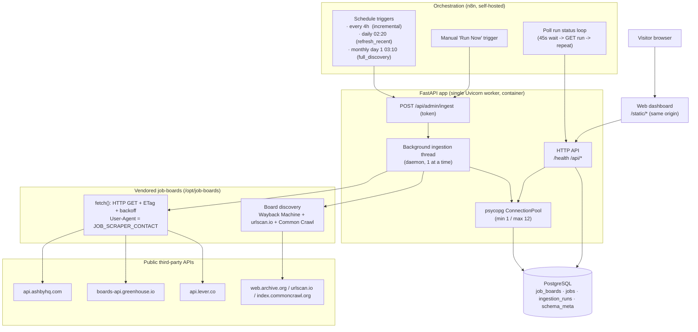

# System Architecture

## Runtime topology

## Components

### FastAPI application (`app/main.py`)

A single ASGI app served by **one** Uvicorn worker (`--workers 1`). One worker matters:
the ingestion sweep runs in an in‑process background `threading.Thread`, and run
de‑duplication relies on there being a single process plus a PostgreSQL advisory lock.

Middleware stack (outermost first):

1. `GZipMiddleware` — compresses responses ≥ 800 bytes.
2. `TrustedHostMiddleware` — rejects requests whose `Host` is not in `ALLOWED_HOSTS`.
3. Custom `security_headers` HTTP middleware — sets `X-Content-Type-Options`,
   `X-Frame-Options: DENY`, `Referrer-Policy`, `Permissions-Policy`, a strict
   `Content-Security-Policy` (`default-src 'self'`, no inline script/style), and
   `Cache-Control: no-store` for `/api/*` / `public, max-age=86400` for `/static/*`.

`docs_url` / `redoc_url` are disabled — there is no Swagger UI in production.

**Lifespan** (`app/main.py:26`): on startup it opens the connection pool, applies
`schema.sql`, force‑fails any `queued`/`running` ingestion run older than 2 hours (crash
recovery), and seeds the board list. On shutdown it closes the pool.

### Ingestion orchestrator (`app/ingestion.py`)

Loads the vendored `job_boards.py` as a module at import time (`_load_upstream`), then
provides:

- **Board seeding** — `ensure_seed_boards()` imports the upstream `boards.seed.json` and
  the repo's `data/india-boards.seed.json` into `job_boards` (idempotent upsert).
- **Board discovery** — `refresh_boards(mode)` writes the current DB board list back to
  the upstream cache file, then calls `upstream.load_boards(refresh=True, …)` to mine
  archives for new slugs and imports the result.
- **The sweep** — `run_ingestion(run_id, mode, limit_per_ats)` takes the advisory lock,
  fans out board fetches across a `ThreadPoolExecutor(max_workers ≤ 8)`, classifies and
  persists each board's result, updates `ingestion_runs` counters every 25 boards, and
  records terminal status.
- **Reclassification** — `reclassify_existing_jobs()` re‑runs the classifier over stored
  rows without any network I/O (used after classifier changes).

`launch_ingestion()` starts `run_ingestion` on a daemon thread and returns immediately so
the HTTP request that triggered it returns `202 Accepted`.

### Classifier (`app/classifier.py`)

Pure, dependency‑free, deterministic functions — no I/O, no model calls. Regex and
keyword rules only. Fully unit‑tested. See [classification.md](classification.md).
On import it merges the slug hints from `data/indian-companies.json` into its
known‑Indian‑company set (missing file is non‑fatal).

### Extra sources & directed discovery (`app/sources.py`)

Beyond the upstream three (Ashby / Greenhouse / Lever):

- **SmartRecruiters** — a native per‑company adapter (pagination + `?country=in`).
- **Workable** — a *feed* source: pull `jobs.workable.com/api/v1/jobs?location=india`
  once per discovery run, cache by company, serve each board from cache. A truncated
  pull is discarded so it can't close jobs.
- **Directed discovery** — probe each per‑slug ATS endpoint with slug candidates from
  `data/indian-companies.json` instead of waiting for a web archive.

All reuse `upstream.fetch` for the User‑Agent / retry / backoff contract. See
[coverage-analysis.md](coverage-analysis.md).

### Database access (`app/db.py`)

A module‑level `psycopg_pool.ConnectionPool` (`min_size=1`, `max_size=12`,
`autocommit=True`, `dict_row` rows). `open_pool()` also executes `schema.sql`, which is
written to be safe to run on every boot (`CREATE … IF NOT EXISTS`, `ON CONFLICT`).
`fetch_one` / `fetch_all` are thin helpers; ingestion uses `pool.connection()` directly
for explicit transactions.

### Configuration (`app/config.py`)

A frozen `Settings` dataclass built once at import from environment variables.
`DATABASE_URL` and `INGEST_TOKEN` are required (the process refuses to start without
them). `SCRAPER_CONCURRENCY` is clamped to `1..8` in code.

### Web dashboard (`app/static/`)

Static HTML/CSS/vanilla JS served same‑origin by the same app. No build step, no CDN, no
third‑party runtime assets (enforced by `tests/test_assets.py` and the CSP). See
[frontend.md](frontend.md).

## Process & concurrency model

| Concern | Mechanism |
|---|---|
| Only one sweep at a time (per process) | `create_or_get_run()` — `SELECT … FOR UPDATE` on any `queued`/`running` run; returns the existing id instead of creating a new one |
| Only one sweep at a time (across processes) | `pg_try_advisory_lock(4912024091)` held for the whole sweep; a second holder fails the run with `another ingestion holds the database lock` |
| Board fetch parallelism | `ThreadPoolExecutor(max_workers = settings.max_workers)` — capped at 8 |
| Memory bound over a ~13k‑board sweep | Completed futures are `pop`ped from the map and results persisted immediately, so parsed ATS payloads do not accumulate |
| Crash recovery | Lifespan marks stale runs `failed`; advisory locks are released automatically when the connection drops |
| HTTP request → sweep | Fire‑and‑forget daemon thread; the request returns `202` with the `run_id` |

## Design principles (from the code and README)

- **The database owns truth.** Classification, lifecycle (`is_active`, `closed_at`), and
  run history all live in PostgreSQL. The browser is a pure view.
- **Fail safe, not open.** A failed board request (`error`) never closes jobs; only a
  *successful* exhaustive response that omits a posting closes it. A 404 (`dead`) closes
  the board and its jobs.
- **Good‑citizen scraping.** Fixed low concurrency (≤ 8), an identifying `User-Agent`
  from `JOB_SCRAPER_CONTACT`, ETag conditional requests to skip byte‑identical boards,
  and reuse of the upstream project's public‑API adapters rather than HTML scraping.
- **Deterministic enrichment.** The classifier is rules‑only so results are reproducible
  and `reclassify` can rebuild derived columns offline.
- **Pinned supply chain.** The upstream discovery/adapters project is vendored at an
  exact commit hash; base images are pinned by digest.
