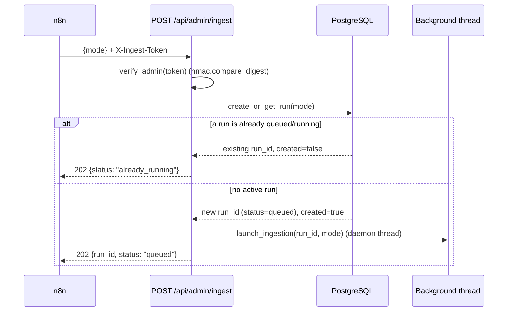
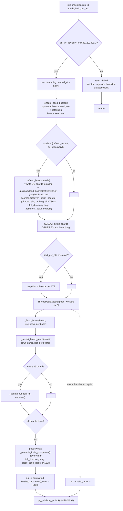
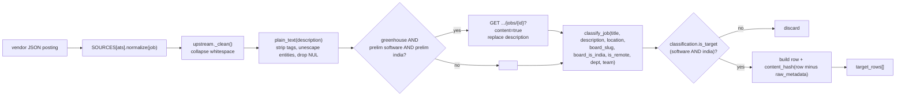
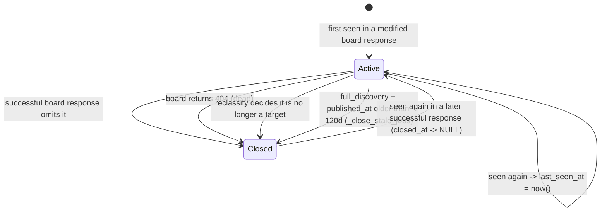

# Data Flow — one ingestion run, end to end

This document traces a single ingestion run from trigger to stored rows. Function
references point at `app/ingestion.py` unless noted.

## Trigger → run record → background thread

- **Auth**: `X-Ingest-Token` header compared to `INGEST_TOKEN` with
  `hmac.compare_digest` (`app/main.py:75`). Missing/wrong → `401`.
- **Mode** (`IngestionRequest`): `incremental` (default), `refresh_recent`,
  `full_discovery`. The CLI additionally allows `smoke`. Validated against
  `ALLOWED_MODES` in `create_or_get_run`.
- **Single‑flight**: `create_or_get_run` does `SELECT id FROM ingestion_runs WHERE status
  IN ('queued','running') … FOR UPDATE`. If a row exists, the same `run_id` is returned
  and **no** new thread starts.

## The sweep

Key points:

- **Board ordering** is deterministic (`ats, lower(slug)`).
- **`use_etag = mode not in {"full_discovery", "smoke"}`.** Full/smoke re‑download every
  board so classifier changes apply everywhere.
- **`limit_per_ats`**: set by the CLI `--limit-per-ats`, or defaulted to `2` for
  `smoke`. It keeps only the first N boards per ATS — a bounded live test.
- **Counters** accumulated across boards: `checked`, `succeeded`, `failed`, `unchanged`,
  `seen`, `targeted`, `upserted`, `closed`. Flushed to `ingestion_runs` every
  `PROGRESS_INTERVAL = 25` boards and once at the end.
- **Worker exceptions** are caught per‑future and converted to an `error` result so one
  bad board never aborts the sweep. An exception *outside* the loop marks the whole run
  `failed`.

## Per‑posting transformation (inside `_fetch_board`)

The row assembled for each target posting carries: identity (`ats`, `source_job_id`,
`board_slug`), display fields (`company`, `title`, `department`, `team`,
`employment_type`, `location`, `city`, `is_remote`, `workplace_type`, `published_at`),
`description` (≤ 60,000 chars) + `description_excerpt` (~420 chars), `apply_url`, and
classifier output (`india_match_reason`, `experience_min/max/level`,
`experience_is_explicit`, `entry_level_score`, `skills[]`,
`salary_min/max/currency/period`). `raw_metadata` (jsonb) keeps department/team/
workplace_type/source published string. `content_hash` is a SHA‑256 over the row minus
`raw_metadata` — stored for change detection/debugging.

## Persisting one board result (`_persist_board_result`)

Each board is persisted in **its own transaction**. Behaviour by `status`:

| `status` | `job_boards` effect | `jobs` effect | Counters |
|---|---|---|---|
| `unchanged` (HTTP 304) | `last_checked_at`, `last_success_at` = now; `consecutive_failures = 0`; `last_error = NULL` | none | `succeeded += 1`, `unchanged += 1` |
| `dead` (HTTP 404) | `is_active = false`; `last_error` set; `consecutive_failures += 1` | **all** active jobs for this board → `is_active = false`, `closed_at = now()` | `failed += 1`, `closed += <n>` |
| `error` (network/parse) | `last_checked_at` = now; `last_error` set; `consecutive_failures += 1` | **none** — failures never close jobs | `failed += 1` |
| `modified` (HTTP 200) | `is_active = true`; `is_india_company |= result flag`; `etag = COALESCE(new, old)`; success timestamps; `consecutive_failures = 0`; `jobs_seen = <n>` | upsert every `target_row` (`UPSERT_JOB_SQL`); then close any active job for this board whose `source_job_id` is **not** in this response | `succeeded += 1`, `seen += <normalized>`, `targeted += <rows>`, `upserted += <rows>`, `closed += <omitted>` |

### The upsert (`UPSERT_JOB_SQL`, `app/ingestion.py:291`)

`INSERT … ON CONFLICT (ats, source_job_id) DO UPDATE`:

- Refreshes all display + classifier columns from the new data.
- `published_at = COALESCE(excluded.published_at, jobs.published_at)` — never lose a known
  timestamp.
- `last_seen_at = now()`, `closed_at = NULL`, `is_active = true` — re‑seen jobs are
  revived.
- `description` / `description_excerpt` keep the previous value if the new one is empty
  (protects against a board response that drops descriptions).
- `first_seen_at` is set once by the column default and never overwritten.

## Closing / lifecycle rules

**Only a successful, exhaustive response closes a job.** Network errors and parse errors
leave jobs untouched — the guiding principle is *never close on uncertainty*. The
120‑day stale close is the one exception, and runs only on the monthly unconditional
sweep where every live posting was just re‑confirmed.

## Terminal state & what the dashboard reads

At the end, `ingestion_runs` has the full tally plus `status = completed | failed`,
`finished_at`, and `error`. The dashboard polls `/api/sync-status` (latest run) and
`/api/stats` (live counts + latest run summary); it never sees boards or the sweep
directly. See [api.md](api.md).
