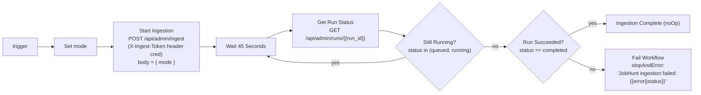

# Orchestration (n8n)

Two n8n workflows drive JobHunt India. Both are exported as JSON in `n8n/` and are
imported into a self‑hosted n8n at `https://n8n.prakhar.wtf`. They ship **inactive**
(`"active": false`) and use header‑auth credentials defined by
`n8n/credential.template.json` (placeholders `__INGEST_TOKEN__`, `__CD_DEPLOY_TOKEN__`,
`__COOLIFY_API_TOKEN__` are filled in at import time and stored only in n8n).

All workflow timezones are `Europe/Berlin`. `callerPolicy: workflowsFromSameOwner`.

---

## 1. Ingestion workflow — `n8n/jobhunt-india-ingestion.json`

*"JobHunt India — Discover & Ingest Jobs"*

### Triggers → mode

| Trigger | Schedule | Sets `mode` | Sweep behaviour |
|---|---|---|---|
| `Run Now` | manual | `incremental` | conditional ETag sweep of all active boards |
| `Every 4 Hours` | every 4h | `incremental` | conditional ETag sweep |
| `Daily Recent Board Discovery` | daily 02:20 | `refresh_recent` | recent Wayback + urlscan.io discovery, then sweep (ETags still used) |
| `Monthly Full Board Discovery` | monthly, day 1, 03:10 | `full_discovery` | full archive discovery, then **unconditional** sweep (ETags ignored) |

Each trigger flows into a `Set` node that writes `{ mode: "<value>" }`, then all four
converge on **Start Ingestion**.

### Flow

- **Start Ingestion** — `POST https://jobhunt.prakhar.wtf/api/admin/ingest`, generic
  header‑auth credential `JobHunt Ingestion API` (`X-Ingest-Token`), JSON body
  `{ mode: $json.mode }`, 30s timeout. Response gives `run_id`.
- **Wait 45 Seconds** — a webhook‑backed wait node; the app runs the sweep asynchronously
  so the workflow polls rather than holding a connection.
- **Get Run Status** — `GET /api/admin/runs/{run_id}` with the same credential.
- **Still Running?** — `IF` on `['queued','running'].includes($json.status)`. True → loop
  back to the wait (indefinite polling until terminal). False → proceed.
- **Run Succeeded?** — `IF` `status === 'completed'`. True → `Ingestion Complete`
  (no‑op). False (`failed`) → **Fail Workflow** raises `stopAndError` with the run's
  `error`, so the n8n execution is marked failed and visible/alertable.

`saveManualExecutions: true` keeps manual runs in history.

### Concurrency safety

The workflow does not itself prevent overlap — the **app** does. If a 4‑hour tick fires
while a monthly full‑discovery is still running, `POST /api/admin/ingest` returns
`created: false, status: "already_running"` with the in‑flight `run_id`, and the new
workflow execution simply polls that same run to completion. PostgreSQL advisory lock
`4912024091` is the hard backstop.

---

## 2. Continuous‑deployment bridge — `n8n/jobhunt-india-continuous-deployment.json`

*"JobHunt India — Continuous Deployment Bridge"*

A thin, token‑protected proxy between **GitHub Actions** and the **Coolify** API, so the
Coolify token never leaves n8n and CI can deploy without direct Coolify network access.
Two independent webhook → HTTP‑request pairs (no schedule):

| Webhook (header‑auth `JobHunt CD Webhook`, `X-JobHunt-Deploy-Token`) | Forwards to (header‑auth `JobHunt Coolify API`, `Authorization: Bearer …`) |
|---|---|
| `POST /webhook/jobhunt-cd-deploy` — *GitHub — Start Deployment* | `POST http://10.0.3.1:8000/api/v1/deploy?uuid=puiczlfsgrn4qcmtksghdoti&force=false` — *Coolify — Queue Deployment*. Returns `{ deployments: [{ deployment_uuid }] }` |
| `POST /webhook/jobhunt-cd-status` — *GitHub — Check Deployment* | `GET http://10.0.3.1:8000/api/v1/deployments/{deployment_uuid}` — *Coolify — Get Deployment*. Returns `{ status, commit, … }` |

Both webhooks use `responseMode: lastNode`, `responseData: firstEntryJson` — GitHub sees
Coolify's raw JSON. `10.0.3.1:8000` is Coolify's private API address reachable from n8n.

See [deployment.md](deployment.md) for how GitHub Actions drives these two webhooks.

---

## Credentials

`n8n/credential.template.json`:

| id | n8n name | Type | Header | Used by |
|---|---|---|---|---|
| `jobhunt-ingest-header-v1` | JobHunt Ingestion API | httpHeaderAuth | `X-Ingest-Token: <INGEST_TOKEN>` | ingestion workflow → app |
| `jobhunt-cd-webhook-header-v1` | JobHunt CD Webhook | httpHeaderAuth | `X-JobHunt-Deploy-Token: <CD_DEPLOY_TOKEN>` | GitHub → CD bridge webhooks |
| `jobhunt-coolify-header-v1` | JobHunt Coolify API | httpHeaderAuth | `Authorization: Bearer <COOLIFY_API_TOKEN>` | CD bridge → Coolify |

`INGEST_TOKEN` must match the app's env var. `CD_DEPLOY_TOKEN` must match the GitHub repo
secret of the same name. The Coolify token exists **only** in n8n.
